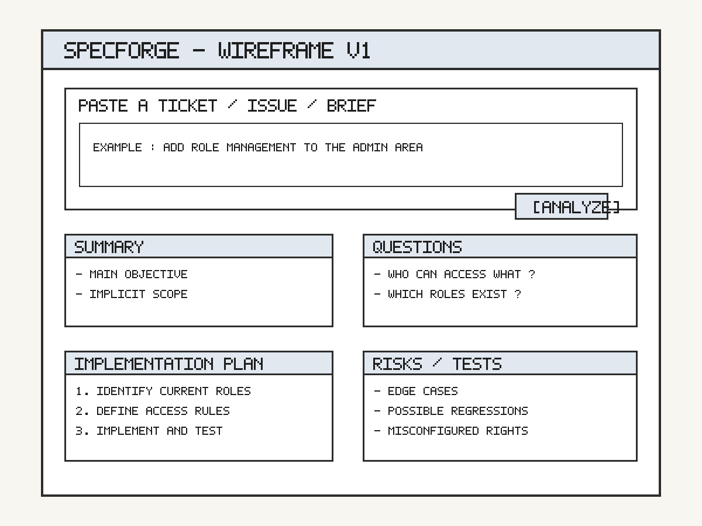

# Product Requirements Document - SpecForge

## 1. Context and Objective

SpecForge is a tool designed to improve technical framing before development starts.

The problem is straightforward: many tickets, GitHub issues, or client briefs are incomplete, ambiguous, or poorly structured. That weak initial definition leads to misunderstandings, missed edge cases, fragile estimates, and technical debt introduced too early.

The objective of this project is to let a user paste a raw text request and receive a structured output before writing code:

- a clear summary of the request,
- ambiguous or missing areas,
- clarification questions,
- a simple implementation plan,
- an initial list of tests or edge cases.

This project is relevant because it targets a frequent pain point early in the workflow. If the framing is better at the start, downstream execution improves as well.

## 2. Scope

### What will be built in the first version

Version 1 must stay intentionally limited:

- a text area where the user can paste a ticket, issue, or brief,
- an analysis of the submitted text,
- a structured output split into several blocks:
  - summary,
  - clarification questions,
  - implementation plan,
  - risks or attention points,
  - test ideas,
- a simple, readable, and fast interface.

### What will not be built in the first version

To avoid over-engineering, V1 will not include:

- automatic code generation,
- IDE integration,
- direct synchronization with GitHub, Jira, or Linear,
- full codebase analysis,
- automatic delivery date estimation,
- autonomous decision-making without human review.

## 3. Personas

### Lea, Junior Web Developer

Lea often receives incomplete tickets. She wants to understand what needs to be done before she starts coding. Her main expectation is a clear summary, the right clarification questions, and a simple plan she can follow with more confidence.

### Karim, Freelance Developer

Karim receives vague briefs from multiple clients. He wants to reduce back-and-forth before estimating or starting a project. His main expectation is to identify ambiguity, dependencies, and technical risks early.

### Ines, Product Builder in a Small Team

Ines sometimes writes tickets too quickly because she lacks time. She wants to improve the quality of the handoff to developers. Her main expectation is a more standard structure and better visibility into missing criteria or questions.

## 4. User Stories

The user stories below are ordered by business importance for the MVP.

### 1. Summarize a vague request

As a junior developer, I want to paste a product ticket into the tool so that I can get a clear and actionable summary of the request.

Why it is high priority:
this addresses the core problem directly; the pain level is high; and the usage frequency is high.

### 2. Surface clarification questions

As a freelancer, I want the tool to highlight unclear parts of a brief so that I can ask the right questions before estimating or starting the work.

Why it is high priority:
this reduces scope drift, which is both frequent and costly.

### 3. Generate a simple implementation plan

As a developer, I want to receive an implementation plan broken down into subtasks so that I can start faster with less ambiguity.

Why it is high priority:
a good task breakdown saves time immediately and improves execution quality.

### 4. Suggest tests and edge cases

As a developer, I want to receive an initial list of tests and edge cases so that I can reduce omissions before development starts.

Why this story is secondary:
it is useful, but it comes after the quality of the initial framing.

## 5. Constraints

### Product Constraints

- the tool must produce a short, structured, and genuinely actionable output,
- the response must not be too generic,
- the user must remain in control of final decisions.

### Technical Constraints

To be confirmed:
the repository does not yet define a final application stack.

Constraints already supported by the current project context:

- the MVP relies on text analysis,
- the interface can remain simple in V1,
- no complex integrations should be required at the start.

If a stack must be proposed to stay consistent with the current repository direction, a reasonable option would be:

- a lightweight frontend in HTML/CSS/JavaScript or a simple framework,
- a minimal backend API,
- an LLM call to generate the structured output.

This is not a confirmed project truth. It must be validated before implementation.

### Performance Constraints

- response time must remain acceptable for daily use,
- the interface must present the result clearly without visual overload,
- the output must be quick to review before implementation starts.

### Legal and Privacy Constraints

- pasted tickets or briefs may contain sensitive information,
- before production use, it must be clarified whether client or product data is sent to a third-party service,
- a minimal privacy policy will be needed if the tool is exposed to external users.

## 6. Mockup

The image mockup is available here:



Simple ASCII mockup of V1:

```text
+---------------------------------------------------------------+
| SpecForge                                                     |
+---------------------------------------------------------------+
| Paste your ticket / issue / brief                             |
|                                                               |
| ------------------------------------------------------------- |
| | "Add role management to the admin area..."                | |
| |                                                           | |
| ------------------------------------------------------------- |
|                                               [Analyze]      |
+---------------------------------------------------------------+
| Summary                                                       |
| - Main objective                                              |
| - Implicit scope                                              |
+---------------------------------------------------------------+
| Clarification Questions                                       |
| - Who can access what?                                        |
| - Which roles already exist?                                  |
+---------------------------------------------------------------+
| Implementation Plan                                           |
| 1. Identify current roles                                     |
| 2. Define access rules                                        |
| 3. Implement and test                                         |
+---------------------------------------------------------------+
| Risks / Tests                                                 |
| - Edge cases                                                  |
| - Possible regressions                                        |
+---------------------------------------------------------------+
```

## 7. AI Suggestions

### Suggestion 1

Add measurable success criteria for V1, for example:

- average time to get a response,
- perceived usefulness of the summary,
- quality of the generated clarification questions.

My comment:
I accept this suggestion in principle because the current document defines the features but not yet how to judge whether the MVP is actually useful. I am not setting precise numeric targets yet because they depend on early user testing.

### Suggestion 2

Define a stricter output format with mandatory sections so that the LLM does not return responses that vary too much from one request to another.

My comment:
I accept this suggestion. It is technically relevant because the perceived quality of the product will depend heavily on output consistency. A stable structure will also reduce the feeling of generic responses.

### Suggestion 3

Add GitHub or Jira integration in V1 to import tickets automatically.

My comment:
I reject this suggestion for V1. The core problem to validate is not automatic import, but the quality of the analysis itself. Adding integrations too early would significantly increase scope, technical complexity, and risk without proving the core product value first.
